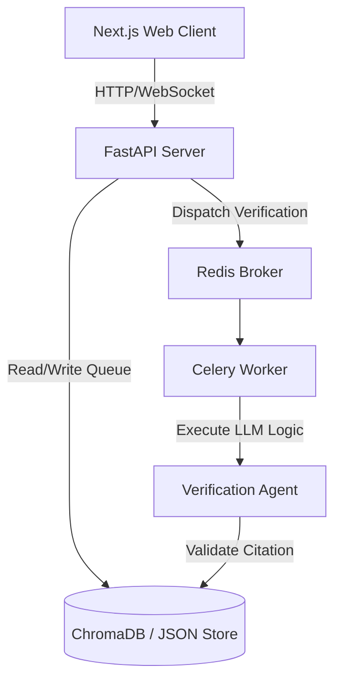

# LexiTrace

LexiTrace is a real-time citation tracing and confidence verification engine designed for AI agent validation. It acts as an automated fact-checker and citation verifier that processes agent outputs, checks them against a vector knowledge store, and flags low-confidence responses for human review.

---

## 🌟 Key Features

*   **FastAPI Backend:** Lightweight, asynchronous server handling agent coordination and verification queues.
*   **AI Agent Verification Engine:** Evaluates citation source accuracy and truthfulness using dedicated LLM verification logic.
*   **Semantic Retrieval:** Integrates ChromaDB vector store for sub-second lookup of context sources.
*   **Celery & Redis Workers:** Handles heavy queue-based verification operations asynchronously in the background.
*   **Next.js Frontend:** Dashboard featuring real-time verification status, chat validation utility, and low-confidence manual review queue.

---

## 🏗️ Project Architecture



---

## ⚙️ Services & Component Breakdown

### 1. Backend (`/backend`)
*   **`main.py`:** FastAPI core APIs and route handlers.
*   **`agent.py`:** LLM agent execution flow.
*   **`retrieval.py`:** Context search and source lookups.
*   **`vector_store.py`:** Database connectors for ChromaDB.
*   **`verifier.py`:** Fact-checking rules and verification methods.
*   **`celery_tasks.py`:** Task definition for the Celery task queue.

### 2. Frontend (`/frontend`)
*   **`app/chat`:** Page to submit messages and see highlighted verification results.
*   **`app/review`:** Portal for human operators to inspect and verify low-confidence responses.
*   **`app/status`:** Real-time health statistics dashboard.
*   **`context/RealtimeContext.tsx`:** Manages live server sent events (SSE) or websocket state.

---

## 🚀 Quick Start

### Prerequisites
*   Docker & Docker Compose
*   Node.js (v18+)
*   Python (v3.10+)

### Running with Docker Compose
To boot up the complete environment including backend APIs, Redis, Celery workers, and Next.js frontend:
```bash
docker-compose up --build
```

### Local Development Setup

#### Backend Setup
1. Navigate to backend directory:
   ```bash
   cd backend
   ```
2. Create and activate a virtual environment:
   ```bash
   python -m venv .venv
   source .venv/bin/activate # Windows: .venv\Scripts\activate
   ```
3. Install dependencies:
   ```bash
   pip install -r requirements.txt
   ```
4. Start FastAPI server:
   ```bash
   uvicorn main:app --reload --port 8000
   ```

#### Frontend Setup
1. Navigate to frontend directory:
   ```bash
   cd ../frontend
   ```
2. Install node packages:
   ```bash
   npm install
   ```
3. Start the Next.js dev server:
   ```bash
   npm run dev
   ```
   *Frontend is now live at [http://localhost:3000](http://localhost:3000).*
