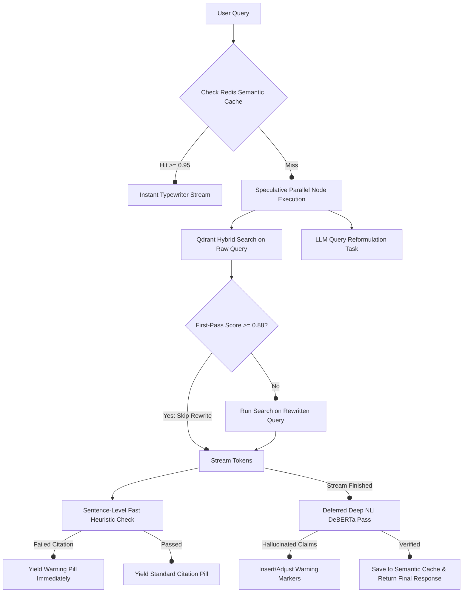

# LexiTrace: Enterprise RAG with Hallucination Entailment & Resilient Sync

LexiTrace is an institutional-grade, real-time Retrieval-Augmented Generation (RAG) platform optimized for sub-second perceived response latency, connection resilience, and high-fidelity citation verification using Natural Language Inference (NLI).

The application features a modern conversational search assistant, a Human-in-the-Loop (HITL) document verification queue, and a live health telemetry dashboard.

---

## Key Architecture & Optimizations

### 1. Latency & Verification Pipeline

```mermaid
graph TD
    A[User Query] --> B{Check Redis Semantic Cache}
    B -- Hit >= 0.95 --o C[Instant Typewriter Stream]
    B -- Miss --o D[Speculative Parallel Node Execution]
    
    D --> E[Qdrant Hybrid Search on Raw Query]
    D --> F[LLM Query Reformulation Task]
    
    E --> G{First-Pass Score >= 0.88?}
    G -- Yes: Skip Rewrite --o H[Stream Tokens]
    G -- No --o I[Run Search on Rewritten Query] --> H
    
    H --> J[Sentence-Level Fast Heuristic Check]
    J -- Failed Citation --o K[Yield Warning Pill Immediately]
    J -- Passed --o L[Yield Standard Citation Pill]
    
    H -- Stream Finished --o M[Deferred Deep NLI DeBERTa Pass]
    M -- Hallucinated Claims --o N[Insert/Adjust Warning Markers]
    M -- Verified --o O[Save to Semantic Cache & Return Final Response]
```

* **Speculative Parallel Retrieval:** To bypass sequential bottlenecks, LexiTrace concurrently queries the Qdrant vector database using the raw user query while running the LLM query rewrite node. If the first-pass retrieval score exceeds `0.88`, it skips query expansion entirely, shaving ~1.5s off the response pipeline.
* **Semantic Caching:** A high-speed Redis semantic cache evaluates incoming query embeddings using cosine similarity. Matches above `0.95` bypass the LLM and stream the cached, verified response instantly.
* **Fast Heuristic & Deferred NLI Verification:** Deep Natural Language Inference (using the `DeBERTa-v3-base` model) can add substantial latency during generation. LexiTrace runs a lightweight word-overlap and strict numerical-matching heuristic during active token streaming, injecting warning flags on-the-fly. Once token output finishes, it runs a background NLI pass to correct or finalize the citation verification.
* **Immediate SSE Flush:** The FastAPI SSE server streams tokens using `asyncio.sleep(0)` on every emission to prevent connection buffering or chunk batching.

### 2. Resilient WebSocket State Sync
* **Sequence Tracking:** Every state event (e.g. queue items approved, pipeline changes) contains an incrementing `event_id`. If the network blips, the frontend reconnection sends the `last_event_id` as a query parameter so the backend automatically re-emits missed messages.
* **Ping-Pong Latency Telemetry:** A 15-second heartbeat loop updates the `/status` telemetry panel in real-time with actual socket latency measurements (e.g. `WebSocket Ping: 12ms`).
* **Optimistic UI Updates:** Approving document segments in the HITL Queue immediately removes them from the frontend state. If the server fails to write to Qdrant, the state is rolled back and a warning toast notification is shown.

### 3. Human-In-The-Loop (HITL) & Interactive Operations
* **Direct Document Ingestion:** Users can drag-and-drop or select PDF batches directly within the chat panel. A multi-phase interactive progress loader displays text extraction, parsing, vector indexing, and registry steps in real-time.
* **Unified Connection State Alerting:** Avoids visual noise by condensing offline status warnings into a single, sleek banner with immediate auto-reconnection indicators.
* **Queue Invalidation via WebSockets:** When a document segment is verified or corrected by an administrator, the item disappears from all connected dashboards instantly without requiring page refreshes.
* **Citation Drawer Inspector:** Displays page boundaries, NLI match status, confidence metrics, and offers structured options to edit extracted document text before ingestion.

---

## Technology Stack

* **Frontend:** Next.js 16 (App Router), React 19, Tailwind CSS v4, Lucide Icons, TypeScript.
* **Backend:** FastAPI, LangGraph (Agentic Workflow Routing), Qdrant Vector database, Redis (Pub/Sub & Semantic Cache), Hugging Face Transformers (`cross-encoder/nli-deberta-v3-base`), OpenAI Embeddings & GPT models.

---

## Directory Structure

```
LexiTrace/
├── backend/
│   ├── main.py              # FastAPI server, SSE stream generator & WS endpoints
│   ├── agent.py             # LangGraph agentic retrieval & grading flow
│   ├── retrieval.py         # Qdrant Hybrid dense/sparse search & BGE Reranker
│   ├── verifier.py          # Fast Heuristic & DeBERTa NLI citation verification
│   ├── cache.py             # Redis semantic query embedding cache
│   └── vector_store.py      # Qdrant schema initialization & document upserts
├── frontend/
│   ├── app/
│   │   ├── chat/page.tsx    # Conversational RAG interface
│   │   ├── review/page.tsx  # HITL Workspace UI
│   │   ├── status/page.tsx  # Telemetry dashboard
│   │   └── globals.css      # Core styles & Tailwind imports
│   ├── components/
│   │   ├── ChatStream.tsx   # Modular streaming messages & thinking line
│   │   └── HITLQueue.tsx    # Workspace queue card list
│   └── context/
│       └── RealtimeContext.tsx # WebSocket connection & heartbeat context
├── docker-compose.yml       # Qdrant service container configuration
└── .env.example             # Setup parameters template
```

---

## Getting Started

### Prerequisites
* Python 3.10+
* Node.js 18+
* Docker Desktop

### 1. External Services Setup
Launch Qdrant and Redis locally:
```bash
# Start Qdrant vector store
docker-compose up -d

# (Optional) If Redis is not installed locally, run it via docker:
docker run -d --name redis_local -p 6379:6379 redis:latest
```

### 2. Backend Installation & Launch
Create virtual environment and install backend dependencies:
```bash
# Initialize and activate virtual environment
python -m venv .venv
source .venv/bin/activate  # On Windows: .venv\Scripts\activate

# Install requirements
pip install -r backend/requirements.txt

# Configure environment variables
cp .env.example .env
# Edit .env with your OPENAI_API_KEY
```

Run the FastAPI application server:
```bash
python -m uvicorn backend.main:app --host 0.0.0.0 --port 8000 --reload
```

### 3. Frontend Installation & Launch
Open a new terminal window to configure and start the Next.js development server:
```bash
cd frontend
npm install
npm run dev
```

The application will be accessible at [http://localhost:3000](http://localhost:3000). You can check the backend documentation schema at [http://localhost:8000/docs](http://localhost:8000/docs).

---

## Environment Variables

Configure these in the `.env` file at the root directory:

| Variable | Description | Default |
| :--- | :--- | :--- |
| `OPENAI_API_KEY` | Key for dense embeddings & chat generation | *(Required)* |
| `QDRANT_URL` | Local or remote url for vector database | `http://localhost:6333` |
| `REDIS_URL` | URL connection string for semantic cache | `redis://localhost:6379/0` |
| `PORT` | API server listen port | `8000` |
