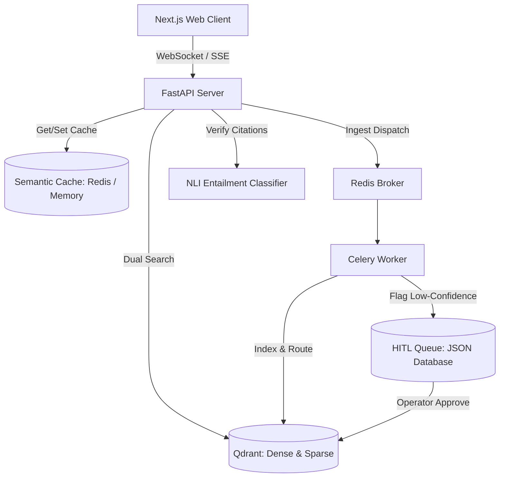

# LexiTrace: Enterprise Citation Tracing & RAG Validation Engine

[](https://nextjs.org/)
[](https://fastapi.tiangolo.com/)
[](https://qdrant.tech/)
[](https://docs.celeryq.dev/)
[](https://huggingface.co/)

LexiTrace is a real-time citation tracing and confidence verification engine designed for AI agent validation. It acts as an automated fact-checker and citation verifier that processes agent outputs, checks them against a vector knowledge store using Natural Language Inference (NLI), and flags low-confidence responses or unverified citations for human review.

---

## 🌟 Key Capabilities

*   **Semantic Hybrid Retrieval:** Integrates Qdrant with dense embeddings and a stateless, deterministic sparse vectorizer to perform dual hybrid keyword search.
*   **HuggingFace NLI Verification:** Validates statement entailment against retrieved sources using `cross-encoder/nli-deberta-v3-base` to detect and flag hallucinations (`[⚠️ Citation Unverified]`).
*   **Semantic Query Caching:** Leverages cosine similarity mapping to bypass the agent execution loop for identical/semantically similar queries (>=95% similarity), offering sub-millisecond response times.
*   **Celery & Redis Worker Queues:** Dispatches heavy ingestion tasks asynchronously to background workers.
*   **Resilient WebSocket Stream:** Reconnects automatically using a sequence-tracked event logger to prevent client-side data loss.
*   **Human-In-The-Loop (HITL) Queue:** A specialized dashboard portal for human operators to inspect, edit, and approve low-confidence OCR scans.

---

## 🏗️ System Architecture


```mermaid
graph TD
    Client[Next.js Web Client] -->|WebSocket / SSE| API[FastAPI Server]
    API -->|Get/Set Cache| Cache[(Semantic Cache: Redis / Memory)]
    API -->|Dual Search| VectorStore[(Qdrant: Dense & Sparse)]
    API -->|Ingest Dispatch| Queue[Redis Broker]
    Queue --> Worker[Celery Worker]
    Worker -->|Index & Route| VectorStore
    Worker -->|Flag Low-Confidence| HITL[(HITL Queue: JSON Database)]
    API -->|Verify Citations| NLI[NLI Entailment Classifier]
    HITL -->|Operator Approve| VectorStore
```

---

## ⚙️ Core Components & Architecture

### 1. Ingestion Pipeline & HITL Fallback
*   Document chunks sent to `/api/ingest` are routed through background workers.
*   **Confidence Threshold (0.85):**
    - **>= 85% OCR Confidence:** Directly indexed into Qdrant.
    - **< 85% OCR Confidence:** Placed in the HITL Queue for manual review, editing, and indexing.

### 2. Retrieval, Caching, & Verification
*   **Hybrid Search:** Dense vector embeddings (OpenAI/Deterministic Mock) combined with deterministic sparse BM25 vectors, merged via Reciprocal Rank Fusion (RRF), and ranked using a Cross-Encoder (`BAAI/bge-reranker-large`).
*   **Hallucination Checking (NLI):** Extracts sentences containing `[Doc X]` tags and passes them along with the document premise to the HuggingFace NLI pipeline. Sentences that fail to achieve the required threshold (0.75 by default) are appended with a `[⚠️ Citation Unverified]` tag.
*   **Semantic Cache:** Direct query cache using vector search. If a incoming query maps close to a cached vector (>=95% cosine similarity), the cached verified response is streamed back instantly.

---

## 🚀 Resilience & Offline Fallbacks

LexiTrace is designed for offline portability. If core microservices are unavailable, the backend seamlessly degrades:
*   **Qdrant Offline:** Automatically instantiates a local in-memory storage client (`location=":memory:"`).
*   **Redis/Celery Offline:** Automatically checks Redis availability and converts to **Eager Execution Mode** (`task_always_eager=True`). Documents are parsed and indexed synchronously in-process instead of blocking the FastAPI server.
*   **Cache Offline:** Automatically falls back to an in-memory dictionary-based semantic cache.
*   **NLI/LLM Offline:** Falls back to a deterministic string overlap and number matching algorithm, and uses a deterministic mock embedding generator.

---

## 💻 Local Development Setup

### Prerequisites
*   Node.js (v18+)
*   Python (v3.10+)
*   Redis / Qdrant (Optional: Local docker containers or fallback mode will handle their absence)

---

### Backend Service Setup
1.  Navigate to the backend directory:
    ```bash
    cd backend
    ```
2.  Create and activate a virtual environment:
    ```bash
    python -m venv .venv
    # Windows
    .venv\Scripts\activate
    # macOS/Linux
    source .venv/bin/activate
    ```
3.  Install dependencies:
    ```bash
    pip install -r requirements.txt
    ```
4.  Start the FastAPI server:
    ```bash
    python -m uvicorn main:app --reload --port 8000
    ```
    *The API will be live at [http://localhost:8000](http://localhost:8000) and Swagger docs at [http://localhost:8000/docs](http://localhost:8000/docs).*

---

### Frontend Service Setup
1.  Navigate to the frontend directory:
    ```bash
    cd frontend
    ```
2.  Install packages:
    ```bash
    npm install
    ```
3.  Start Next.js in development mode:
    ```bash
    npm run dev
    ```
    *The Client dashboard will be live at [http://localhost:3000](http://localhost:3000).*

---

## 🛠️ Testing Local Workflows
To test document ingestion and citation tracing:
1.  Ensure backend server is running on `port 8000`.
2.  Execute the ingestion test script:
    ```bash
    python backend/test_ingest.py
    ```
3.  This script simulates parsing a PDF containing tables and text, and registers them. If offline, the fallback modes will index these into the local in-memory Qdrant store.
